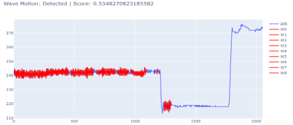
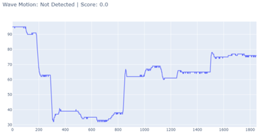

# Detection of ships with dragged anchors

## Problem statement: 
- A “dragging anchor” means the ship drifts without holding power even though it has been anchored. This can lead to less or more serious incidents, as collisions, groundings or strandings
- Power cable between Bornholm, Denmark and Sweden was hit by dragged anchor at 26th February 2022. The vessel name was “Samus swan”
- The damage done was worth millions of euros.

## Objective:
To develop an algorithm that can detect if a ship is dragging its anchor based on real-time AIS data
This can provide an early warning system and can prevent from accidents and huge losses.

## Algorithm:

1. Tt was observed that the AIS data of the ships with dragged anchor (ship name: SAMUS SWAN) were showing high frequency variation on the heading of the ship. 

    - Heading is the direction in which a vehicle/vessel is pointing at any given moment. It is expressed as the angular distance relative to north, usually 000° at north, clockwise through 359°, in degrees of either true, magnetic, or compass direction

2. Algorithm was developed to identify these motion in the heading AIS data of ships. 

    - Showing heading variation of ships on map:  you can observe the zig zag motion shown by the ship which was dragging anchor

    - Showing the heading variation profile on time scale 

3. Algorithm results: 

Ship that was dragging its anchor:

Ship that wasn't dragging its anchor:

A score was defined which is the fraction of zig-zag motion on heading data detected by the algorithm
